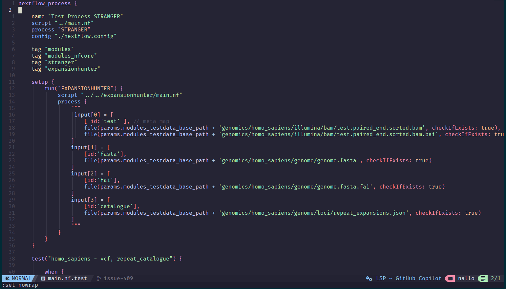

# tree-sitter-nftest
Syntax highlighting for nf-test that actually works!

Before ([nextflow-io/vim-language-nextflow](https://github.com/nextflow-io/vim-language-nextflow)):
 

After ([nvim-treesitter](https://github.com/nvim-treesitter/nvim-treesitter) and tree-sitter-nftest):


## Installation
Using [NeoVim](https://neovim.io) and [nvim-treesitter](https://github.com/nvim-treesitter/nvim-treesitter):

1. Run `:TSInstall groovy`
2. Add to your configuration (e.g. `init.lua`):
   ```lua
   -- Add parser
   local parser_config = require "nvim-treesitter.parsers".get_parser_configs()
   parser_config.nftest = {
     install_info = {
       url = "https://github.com/Schmytzi/tree-sitter-nftest",
       files = {"src/parser.c"}, 
       -- optional entries:
       branch = "main", -- default branch in case of git repo if different from master
       generate_requires_npm = false, -- if stand-alone parser without npm dependencies
       requires_generate_from_grammar = false, -- if folder contains pre-generated src/parser.c
     },
   }

   -- Add filetype autodetect
   vim.filetype.add({
       pattern = {
           [".*%.nf%.test"] = "nftest"
       }
   })
   ```
3. Run `:TSInstall nftest`
4. Copy queries to your runtime path, subdirectory `queries/nftest`

Code screenshots are from [nf-core/modules](https://github.com/nf-core/modules).
